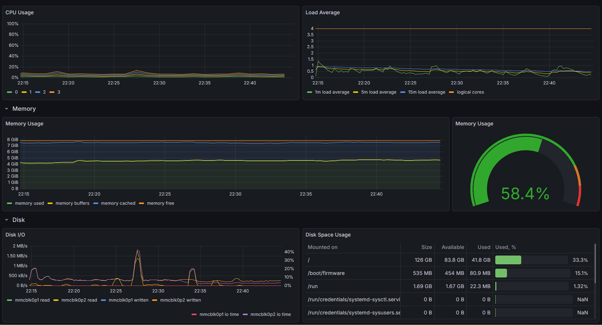

# homelab

This is a collection of config manifests for my homelab.

> [!IMPORTANT]
> This repository will likely always be a work in progress and some components may not be immediately integrated.

# Hardware

1. HP EliteDesk 800 G2 Mini 35W Desktop i5-6500T@2.5GHz 16G DDR4 256G SSD WiFi
2. Raspberry Pi 5 - 8G 126G Micro SD

# Components

[k3s](https://k3s.io/) - [tailscale](https://tailscale.com/) - [pihole](https://pi-hole.net/) - [ufw](https://help.ubuntu.com/community/UFW) - [traefik](https://doc.traefik.io/traefik/) - [argocd](https://argo-cd.readthedocs.io/en/stable/) - [cert-manager](https://cert-manager.io/) - [reflector](https://github.com/emberstack/kubernetes-reflector) - [external-secrets](https://external-secrets.io/) - [homepage](https://gethomepage.dev/) - [kube-prometheus](https://github.com/prometheus-operator/kube-prometheus/tree/main)

---

